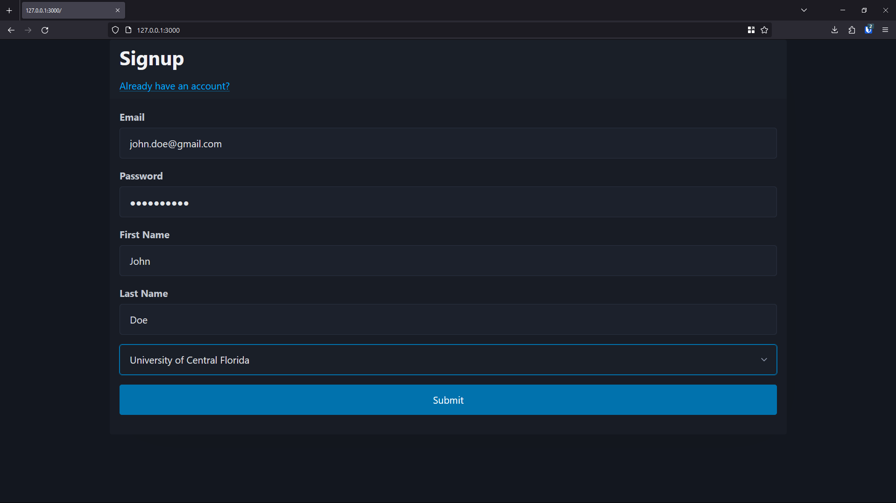

# College Event Website

## Showcase

### Signup
[](Signup Page)

### Event Dashboard
[<img src="examples/ui/event_dashboard.png"](Event Dashboard)

### Event Creator
[<img src="examples/ui/event_creator.png"](Event Creator)

### Event Info
[<img src="examples/ui/event_info.png"](Event Info)

### Rso Dashboard
[<img src="examples/ui/rso_dashboard.png"](Rso Dashboard)

### Rso Creator
[<img src="examples/ui/rso_creator.png"](Rso Creator)

## Build
```sh
cd $PATH_TO_REPO && go build .
```

## Run
```sh
./cew
```

## Help
To view what can be configured using CLI args, type and run the following:
```
./cew --help
```

## Notes
The server uses Postgres as its backend. By default, the username and password is assumed to be `postgres`, and the database name is assumed to be `college_event_website`. The `schema.sql` file in `src/gen_sql` can be used to initialize the structure of the database. One can then POST to `/api/v1/init` for populating the database with default events from `events.ucf.edu` and creating a sample SuperAdmin that can then approve and disapprove any public events.